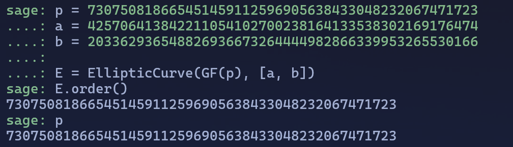

# O(1) Punch Log

```
Bruteforcing it doesn't make sense when you can be smart.
```

Going through the source file given leads us to the following conclusions.

- This is an elliptic curve of a prime order.
- The challenge was made on sage math, so it is inferable to solve this challenge on sage

```python
import flag
import Crypto.Util.number as c

p = 730750818665451459112596905638433048232067471723
a = 425706413842211054102700238164133538302169176474
b = 203362936548826936673264444982866339953265530166

E = EllipticCurve(GF(p), [a, b])
```

The script imports the necessary libraries and defines the elliptic curve based on the given parameters, the parameters in themselves seem random but the prime should be analyzed further as in every other elliptic curve.

```python
P0 = E.lift_x(344338284117963723703790671118658790497555124168)
P = [P0[0]]

j = 0
for i in range(0,len(flag), 5):
  n = c.bytes_to_long(flag[i:i+5].encode())

  P.append((n*E.lift_x(P[j]))[0])
  j = j + 1
```

The loop iterates over our curve and hides the flag iteratively over the curve, the length of string being encrypted at once is 5. as we know that every flag is of the format $pearl\{alphanum123\}$

The first point after the iteration starts can be gathered from this string "pearl" as it is also 5 characters.

Essentially, the secure nature of elliptic curves comes from the difficulty in solving the `discrete log probelem` on prime fields of very large numbers. The script makes use of the property by converting the flag into segments of characters and then converting that to an integer number using `bytes_to_long` utility in Python's Crypto library.

<div align="center" style="font-size: 20px; font-weight: bold; font-style: italic;">
    P = k*Q
</div>

Where k is the private key, which is basically the integer form of fragments of our flag and thus what we need to find out as we are given the output coordinates.

Trying to bruteforce the coordinates doesn't result in any output as for the large prime bruteforcing is not feasible.

Using sage math we can look up various properties of this curve but the one that stands out is when we look up the order of the Elliptic Curve.

<br>

And we find out that the order of the curve is equal to the prime field of the curve that it is defined upon.

Now searching a bit about elliptic curves with such properties leads us to this research paper.

[Weak Curves](https://wstein.org/edu/2010/414/projects/novotney.pdf)

From here we can infer that the vulnerability hiding in the curve can be broken by Smart's attack using the $p-Adic Numbers$

Implementing the algorithm in a sage script we get this

```python
import Crypto.Util.number as c

def smart_attack(p, A, B, xP, yP, xQ, yQ, precision=10):

    print("[*] Initializing attack...")

    # Step 1: Define the elliptic curve over GF(p)
    print("[*] Constructing the elliptic curve over GF(p)...")
    E = EllipticCurve(GF(p), [0, 0, 0, A, B])

    # Step 2: Verify that the curve is anomalous
    if E.order() != p:
        raise ValueError("[✖] The curve is NOT anomalous! The order is not equal to p.")

    print("[✔] Curve is anomalous! Proceeding with Smart's attack...")

    # Step 3: Lift the curve to Q_p
    print("[*] Lifting the curve to Q_p...")
    Qp_ring = Qp(p, precision)  # Create Qp with specified precision
    Ep = EllipticCurve(Qp_ring, [0, 0, 0, A, B])

    # Step 4: Lift the points to Q_p
    print("[*] Lifting points P and Q to Q_p...")

    def lift_point(x, y):
        """Lift a point (x, y) from GF(p) to Q_p."""
        x_p = Qp_ring(x)
        y_p_sqrt = (x_p^3 + Qp_ring(A) * x_p + Qp_ring(B)).sqrt()

        if not y_p_sqrt:
            raise ValueError(f" Unable to lift point ({x}, {y}) to Q_p.")

        # Select the correct root based on sign
        y_p = y_p_sqrt if y_p_sqrt[0] == y else -y_p_sqrt
        return Ep(x_p, y_p)

    Pp = lift_point(xP, yP)
    Qp_lifted = lift_point(xQ, yQ)

    print(f" Lifted P: {Pp}")
    print(f" Lifted Q: {Qp_lifted}")
    print("-" * 50)

    # Step 5: Compute formal logarithms
    print("[*] Computing formal logarithms...")

    lQ = Ep.formal_group().log()(- (p * Qp_lifted)[0] // (p * Qp_lifted)[1]) / p
    lP = Ep.formal_group().log()(- (p * Pp)[0] // (p * Pp)[1]) / p

    print(f"[✔] log(Q) = {lQ}")
    print(f"[✔] log(P) = {lP}")
    print("-" * 50)

    # Step 6: Solve for the discrete logarithm e
    print("[*] Solving for discrete logarithm e such that Q = [e]P...")
    e = lQ / lP

    print(f"[✔] Computed e = {e[0]}")

    # Step 7: Verify the result
    assert e[0] * E(xP, yP) == E(xQ, yQ), "[✖] Incorrect discrete logarithm!"

    print(f"\n--> [FLAG] Discrete Logarithm Found: {e[0]}\n")
    return e[0]

p = 730750818665451459112596905638433048232067471723
a = 425706413842211054102700238164133538302169176474
b = 203362936548826936673264444982866339953265530166

output = [344338284117963723703790671118658790497555124168, 260447762554553251289922391132710160711408253100, 651277720123486161075689024333545407539538157640, 500080632050259613269921934837973984254718648438, 683211176955383769290398013608858348596484221573, 37103301988693271924307570949844036347800545475]

output_y = [299247302786516342875640670883006145903525200231,
 287647263905849746687673733989246770792331331885,
 386463102444602423497645885328426694886944523995,
 542596982720241683069467565871647093841409673056,
 442051445945286547612022898542651747228190499626,
 427964998995541553483081870109300646017521966311]

str = ''

for i in range(0,5):

    decoded_out = smart_attack(p,a,b,output[i], output_y[i], output[i+1], output_y[i+1])
    str += c.long_to_bytes(decoded_out).decode()

print(str)

```

The Script should directly output the flag to us and we get,

The flag is `pearl{smart4ss_b3ats_3cc}`
