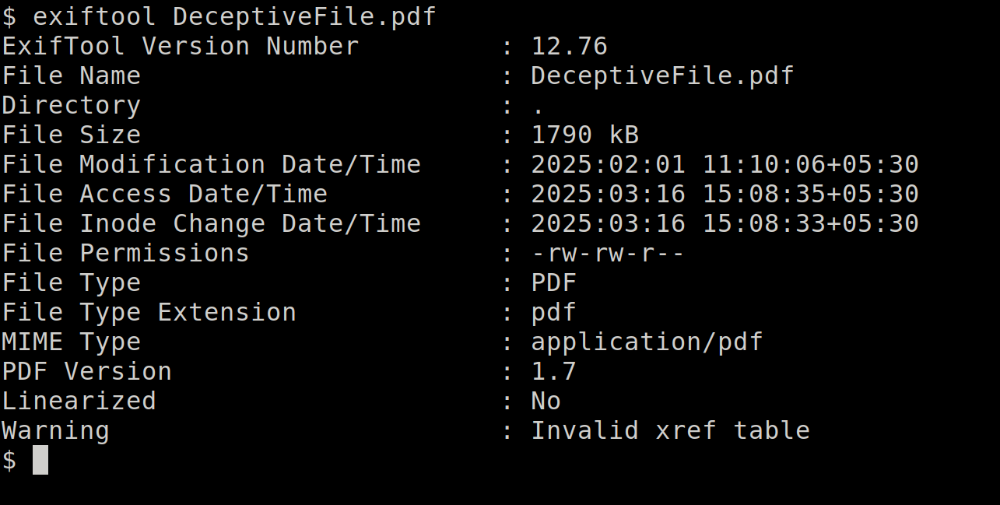
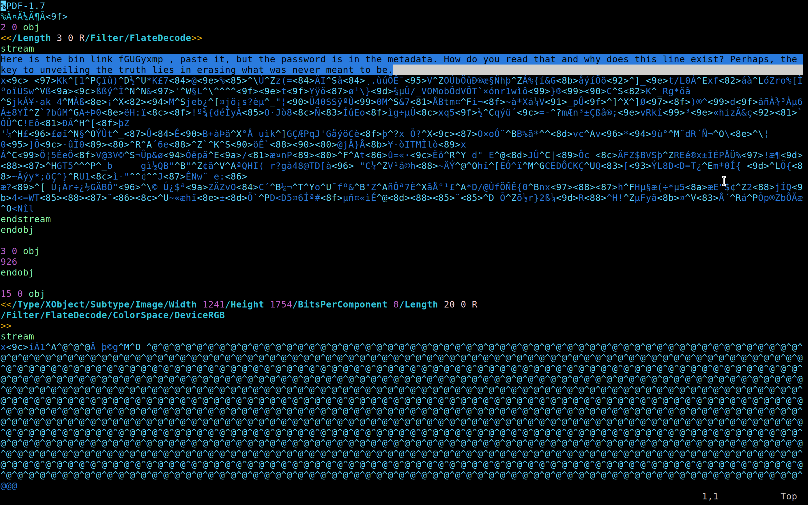
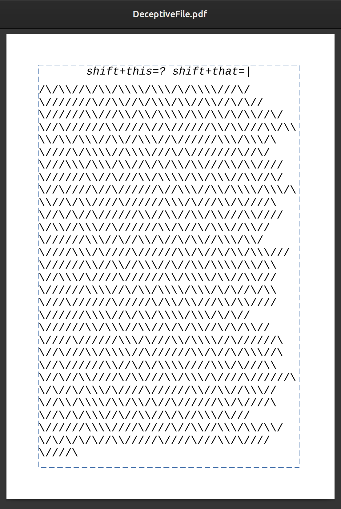
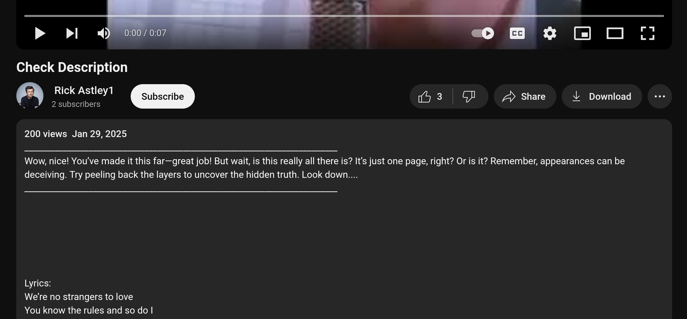
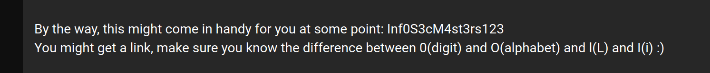
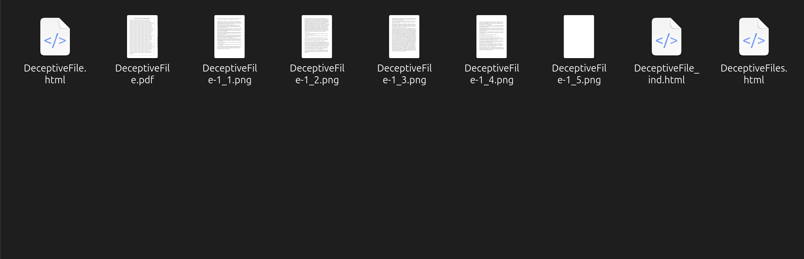
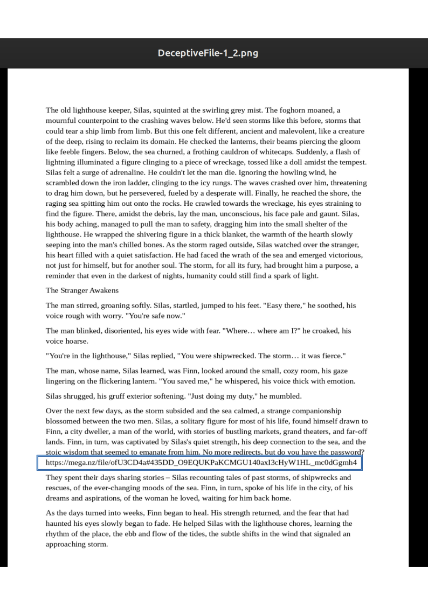
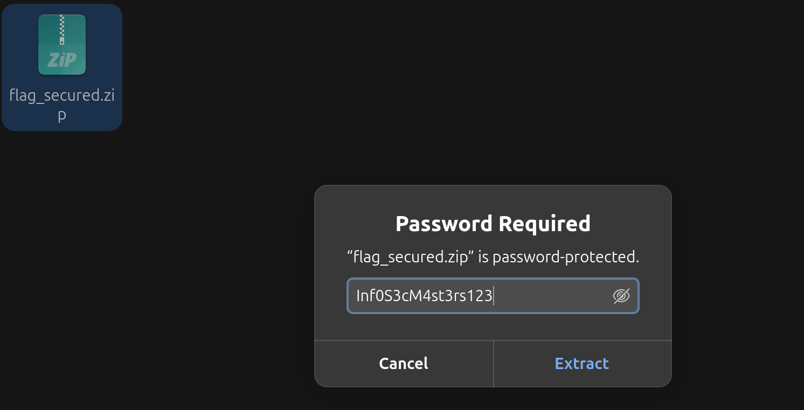
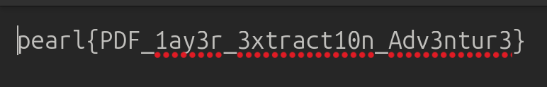

## CTF Write-Up: PlayerDelF

**Challenge Name:** PlayerDelF\
**Author:** iamgreedy

---

### **Challenge Info:**

> Sometimes, the meaning is hidden in the spaces between the words—don’t just focus on what’s on the surface.
>
> But before that, it’s a PDF, but why isn’t the content showing? Maybe the answer lies in what you don’t immediately see. Try looking a bit deeper, especially where things begin.

---

### **Analysis and Solution:**

#### **1. Opening the File**

- The PDF initially appeared empty or possibly corrupted.
- Checking its metadata revealed nothing useful, just an error.
- The hint suggested to look "where things begin."



#### **2. Inspecting with a Text/Hex Editor**

- Opening the file in a hex editor showed a suspicious first line.
- This line contained a **Pastebin link** and a message: *"Erasing what was never meant to be."*
- The metadata was also mentioned, but it appeared empty.
- The stream data in object 2 seems unusual—the unwanted line needs to be removed to match the specified length of 926.
- **Deleting the first line of the file** caused the metadata to reveal a password.



#### **3. Checking the Pastebin Link**

- The Pastebin link is a trap—it leads to a rickroll.

#### **4. Extracting Hidden Content from the PDF**

- With the first line removed, the PDF became readable.
- The visible content contained a string with slashes (`/`).
- Replacing `/` with `0` and `\` with `1` converted it into binary.
- Decoding the binary led to a **YouTube link**.



#### **5. YouTube Video and Description**

- The YouTube link was another Rickroll, but the **video description contained a hint** about "layers."
- Scrolling down, there was a line of text that looked like a **password**.





#### **6. Extracting Layers from the PDF**

- Following the hint about layers, I extracted the PDF using:

  **Using ****************`pdftohtml`****************:**
  ```bash
  pdftohtml DeceptiveFile.pdf 
  ```
  **OR Using GIMP/Photoshop:**
  - Opened the PDF and checked hidden layers.
- This revealed additional hidden pages containing a **Mega link**.




#### **7. Downloading the Final File**

- The **Mega link** led to a zip file named `flag_secured.zip`.
- Using the **password from the YouTube description**, I extracted the contents.
- Inside the zip file was the final flag!




### **Final Flag:**

```
pearl{PDF_1ay3r_3xtract10n_Adv3ntur3}
```

