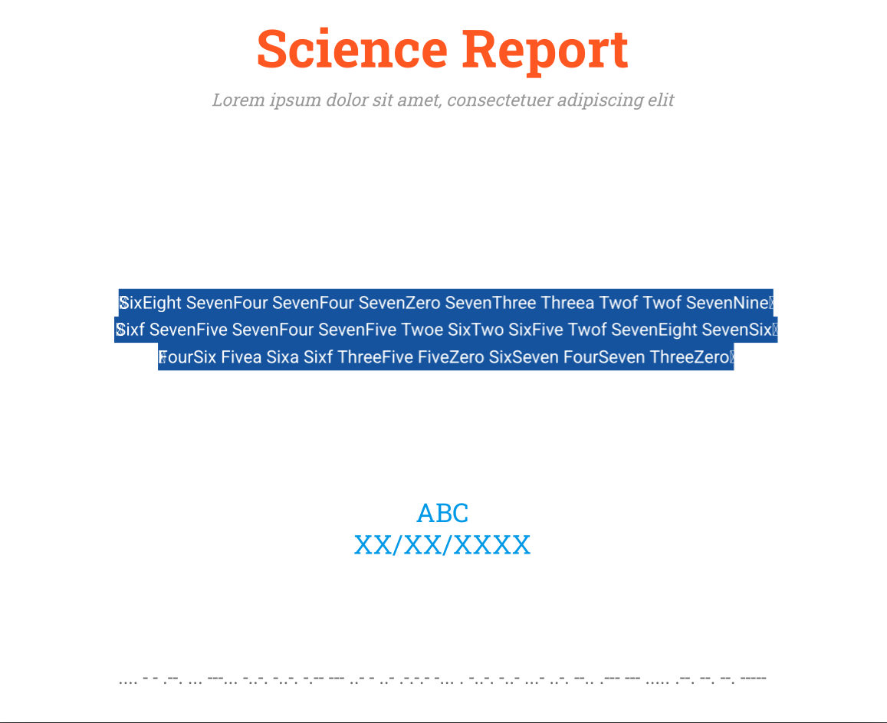
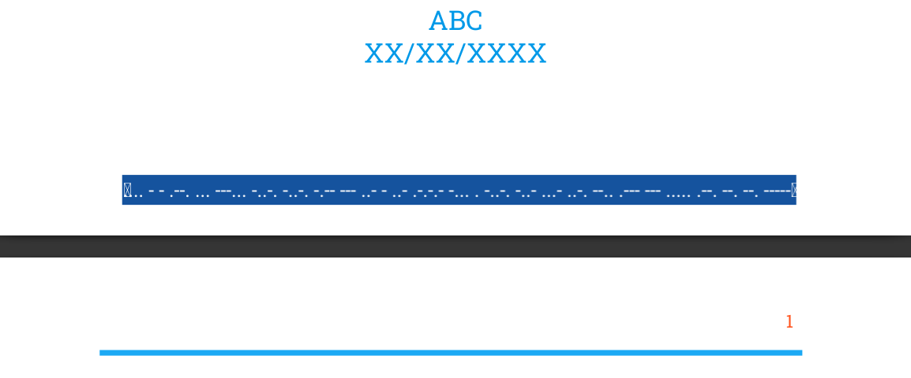

## CTF Write-Up: SentMail

**Challenge Name:** SentMail  
**Author:** iamgreedy  

---

### **Challenge Info:**  
> Vortex prefers simplicity, but iamgreedy. I want more—(text & background), they don’t tell the whole story. Have you checked the footer? And don't forget, there's something unique about the file name. It might just be the key.

---

### **Analysis and Solution:**

#### **1. Text & Background**
- The PDF contains misleading text leading to a rickroll, indicating the flag is hidden elsewhere.



#### **2. Footer Investigation**
- The footer contains Morse code, which also leads to a rickroll, confirming it as a red herring.



#### **3. File Name Clue**
- "SentMail" suggests email-related features.
- PDFs support embedded attachments, so checking the **attachments tab** reveals `flag.txt` inside the document.


#### **Extracting the Flag**
- You can directly extract the flag from the pdf reader or:
- Use tools like:

  **Using `pdfdetach` (Poppler-utils):**
  ```bash
  pdfdetach -saveall sentmail.pdf
  ```
  
  **Using `pdftk`:**
  ```bash
  pdftk sentmail.pdf unpack_files
  ```
  
- Extracting `flag.txt` reveals the flag!


### **Final Flag:**
```
pearl{I_N3v3r_Kn3w_PDF5_Att4ch}
```

