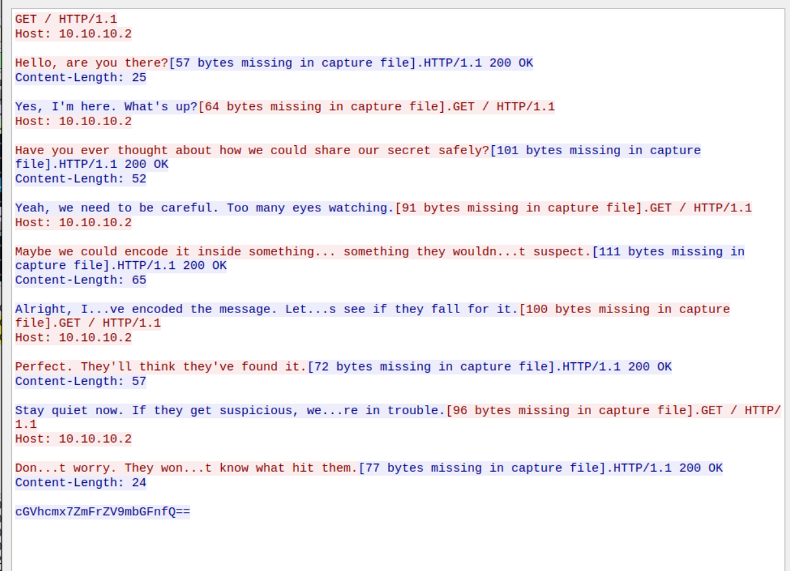

# The Covert Exchange

This challenge involves analyzing a packet capture (PCAP) file using Wireshark. The objective is to extract an AES-encrypted message hidden within UDP packets and decrypt it using a key hidden in TCP packets.

## Step 1: Analyzing the Packets
Upon opening the PCAP file in Wireshark, we first analyze the captured packets. Sorting the packets, we observe various protocols, including TCP, UDP, and HTTPS.

<p align="center">
  
</p>

## Step 2: Identifying the UDP Packets
Filtering for UDP packets, we notice a set of **eight UDP packets** originating from the same source IP but sent to different destination IPs. Extracting the data from these packets and arranging them in order according to their destination IPs reveals an AES-encrypted text.

### Alternative Method:
Another way to identify these eight UDP packets is by using **Protocol Hierarchy** (Statistics > Protocol Hierarchy) and applying a data filter.

## Step 3: Searching for the Decryption Key
Since the extracted message is encrypted using AES, we need to locate the encryption key.

- Checking the **HTTPS packets**, we find a conversation where some information is exchanged in Base64 encoding. However, decoding it reveals a **fake flag**, which is a decoy.
<p align="center">
  
</p>

- Looking into the **TCP packets**, another conversation is visible. Within this exchange, an RSA-encrypted message is transmitted.

<p align="center">
  
</p>

## Step 4: Extracting the AES Key
Decrypting the RSA-encrypted message using the provided public key reveals the secret AES key:

```
thisisasecretkey
```

## Step 5: Decrypting the AES Message
Using the extracted AES key, we decrypt the message from the UDP packets. The decrypted message gives us the final flag:

```
pearl{tcp_hides_keys_udp_hides_flag}
```


