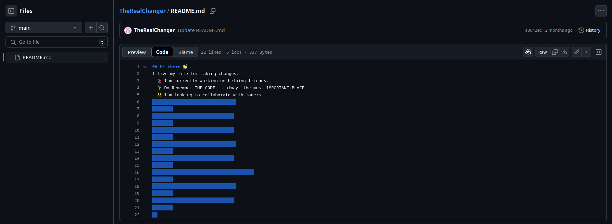

# Quick Reply Race

## Challenge Prompt

_Mr. X is a very suspicious man. Nobody even knows his name. But sometimes when he feels a person is worth his time, he gives them a QR code which has his name. But even that is a test! But a hacker figured it out and made his mark which impressed Mr.X who gave him the flag. Can you find the flag?_

**Flag Format:** `pearl{flag}`
**Note:** 2 images are provided. One is a test QR and one is the challenge QR.


---

# Solution Walkthrough

### Step 1: Figuring out what was wrong with the challenge QR

On first glance, it is hard to figure out what is wrong with the test QR given that it is not working. But on comparison with the test QR (which was a working QR), we can figure out that the challenge QR has barely any data in the usual data positions and it is suspiciously filled out black near the location squares which are usually surrounded with whitespaces.


This hints that the QR could be corrupted by inversion except for the location squares which is why it not being read by the QR scanner.

### Step 2: Correcting the challenge QR

On using any photo editing tool we can mask out the location squares and invert them after inverting the intial given QR. This makes the challenge QR readable.

After correcting the QR and scanning it, we get the name _GermanIris_.

### Step 3: Identifying "GermanIris"

From the prompt, it is told that the QR would give a name. This would mostly be a username to some account Mr.X has.

The username "GermanIris" suggests that it might be traceable online. A common OSINT tool for such searches is [sherlock](https://github.com/sherlock-project/sherlock), which scans various social media platforms for accounts matching a given username.

Running 'sherlock GermanIris' reveals a GitHub account.

### Step 4: Analyzing the GitHub account "GermanIris"


We see that there are 4 repositories on the Github account each having some random information. These might be signifcant or might be to throw us off the track.

On glancing each repository first, we can see that in the repo "Pycodes" there are is a contributor other than GermanIris himself. This is very suspicious.


Considering the story given in the prompt, this could be the hacker who has the flag. The account name is _TheRealChanger_.

### Step 5: Analyzing the account "TheRealChanger"

On opening the account _TheRealChanger_, we see that there are no repositories except for the README file. On reading the read me file we see that it is slightly suspicious.


On opening the code for the readme file, we find that there are alot of empty whitespaces under the actual written content.



This could be whitespaces which could hold some significance.

### Step 6: Analyzing the Whitespaces and solving it

The whitespaces could have been encoded using the whitespace language. We can decipher this on a well known deciphering site "dcode.fr".


This gives us a weird string of words which could be further encoded. On the same site, we can run the cipher identifying tool on this string.


This gives us that the string could be a pastebin link.

On opening the pastebin link, we get the flag for the challenge.


Thus, the final flag is:

```plaintext
pearl{QR_R3c0v3ry_R4c3_s0lv3d}
```
