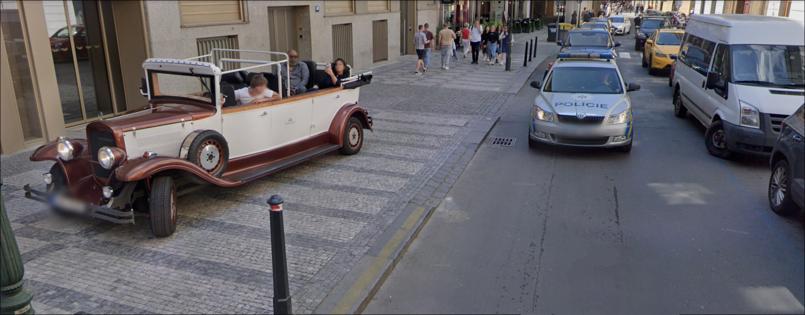
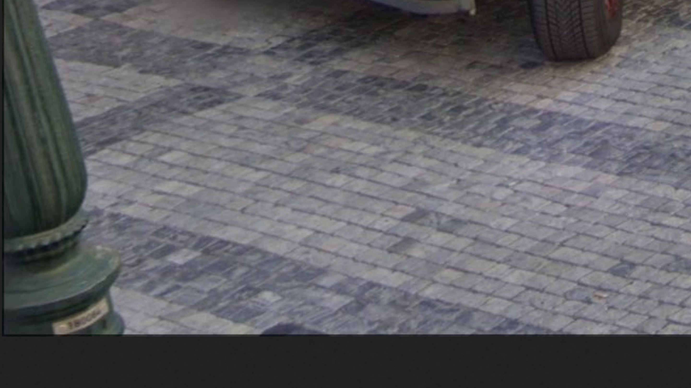

# Hidden Marker

## Challenge Prompt

_A whistleblower going by the pseudonym "spiriteawx" has exposed a major art smuggling operation, leaking critical financial documents and leaving cryptic clues. Your mission: Uncover the location of the smuggling activities and identify the associated transaction._

**Flag Format:** `pearl{<street-name>_<transaction-id>}`  
**Note:** Strip special characters (e.g., accents) from the street name when entering the flag. (If necessary)

---

## Solution Walkthrough

### Step 1: Identifying "spiriteawx"

The username "spiriteawx" suggests that it might be traceable online. A common OSINT tool for such searches is [sherlock](https://github.com/sherlock-project/sherlock), which scans various social media platforms for accounts matching a given username.

Running `sherlock spiriteawx` reveals a Twitter account.

### Step 2: Analyzing the Twitter Account

Upon visiting the Twitter profile, the pinned post states:

> URGENT: Evidence of major art smuggling operation uncovered. Authorities must act now.  
> Financial records of the transactions can be found here: [https://pastebin.com/MWH1g7rE](https://pastebin.com/MWH1g7rE)

Additionally, an image is attached to the tweet.



### Step 3: Reverse Image Search

Using a reverse image search (Google Lens, TinEye, or Yandex), the image is identified as being taken in **Prague, Czech Republic**.

### Step 4: Determining the Street Name

Zooming into the image, there is a slightly blurry number written on a lamp post: **180064**.



Researching Prague’s lamp post numbering system leads to this source:  
[What do the numbers on the lamp posts mean in Prague?](https://stuhit.com/what-do-the-numbers-on-the-lamp-posts-mean-in-prague/)

This source explains that Prague has a **government mapping system** for identifying locations based on lamp post numbers. The official website for searching lamp post locations is:  
[https://zjisti.si/zarizeni](https://zjisti.si/zarizeni)

Entering **180064** into the website reveals that the lamp post is on **Celetná Street**.

### Step 5: Finding the Transaction ID

Opening the [Pastebin link](https://pastebin.com/MWH1g7rE) reveals a large list of transactions. Scrolling down, a particular transaction appears as:

> `[REDACTED BY ADMIN]`

Suspiciously, the Pastebin link also displays an "edited" label, and a comment below states:

> "It was there. I swear!"

### Step 6: Recovering the Original Transaction ID

To find what was redacted, we check the **Wayback Machine** ([https://web.archive.org/](https://web.archive.org/)). Searching for the Pastebin link in archived snapshots, we find a previous version.

Comparing the old and new versions, the original transaction ID is revealed.

### Step 7: Constructing the Flag

We now have:

- **Street Name:** `celetna`
- **Transaction ID:** `6382938`

Thus, the final flag is:

```plaintext
pearl{celetna_6382938}
```
