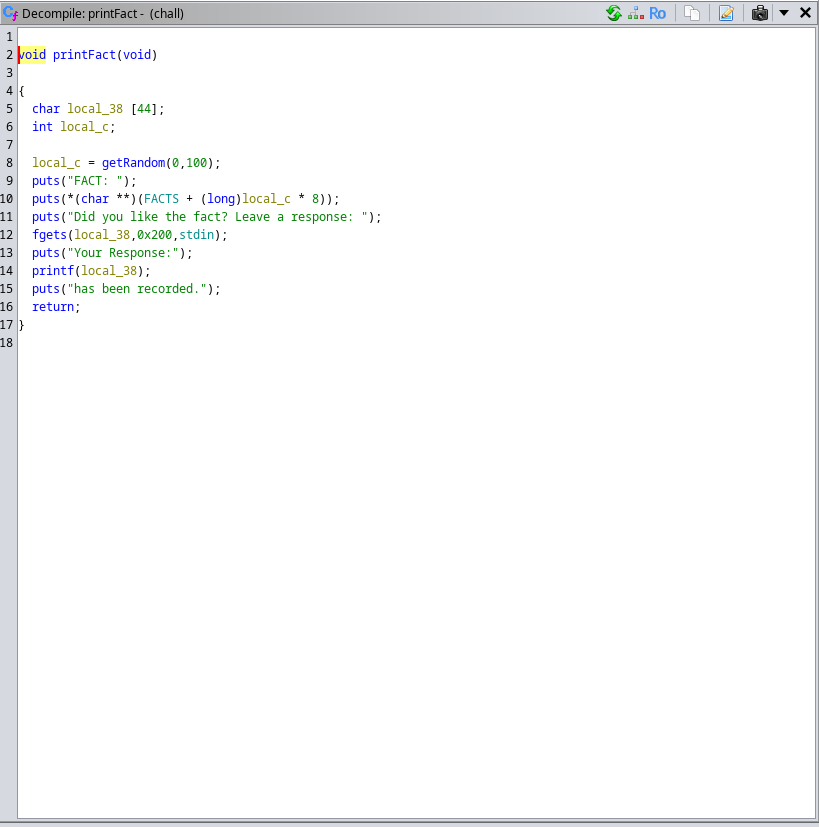

### Mr. %ROPOT% writeup

Prompt:
```Would you like some joke or fact? Don't forget to leave a review!```

Author: `bond@james`

Points: `350`

Files: [mrropot.zip](./mrropot.zip)

On analyzing the binary with ghidra, we find that the function `printFact` is vulnerable. It prints a random FACT from FUN_FACTS file, and asks for a response. Here we can see that the buffer size is 44 bytes but fgets takes upto 512 bytes. So we have a buffer overflow here. Our response is also printed back and directly passed into printf. So, we have a format string vulnerability as well.



Using these two vulns, we can leak libc addresses, find the libc base address and get the shell.

Here is the solve script:
[mrropot.py](./mrropot.py)

#### Flag:
`pearl{fin4lly_g0t_my_fl4g_th4nks_printf}`
