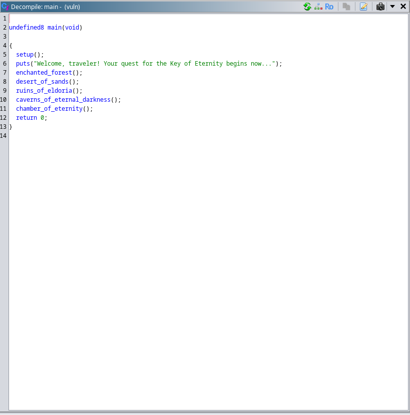
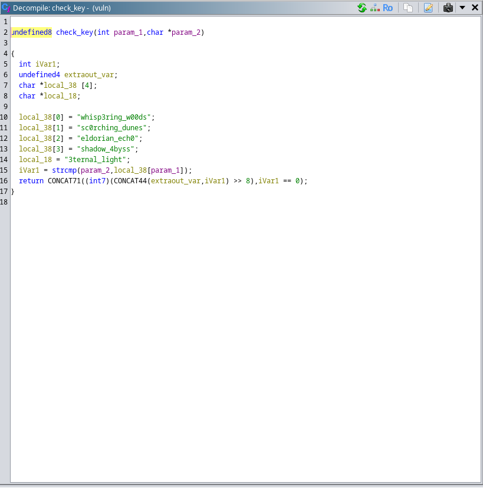
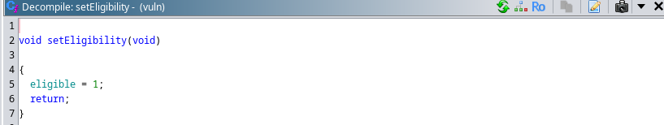
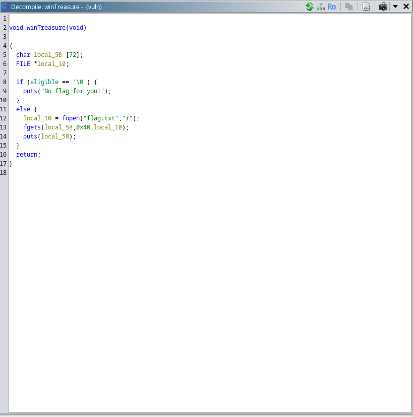

### Treasure Hunt writeup

Prompt:
```Are you worthy enough to get the treasure? Let's see...```

Author: `bond@james`

Points: `300`

Files: [treasurehunt.zip](./treasurehunt.zip)

On analyzing the binary with ghidra, we see there are some functions which are called in the main function. 

There is a winTreasure function as well, which can read the flag.txt file for us. (Check the functions in ghidra.)



All the functions from `enchanted_forest` to `caverns_of_eternal_darkness` asks for a mystery key, if it's correct we return successfully and move to the next function.

The keys can be found in `check_key` function:



In the last function `chamber_of_eternity`, we can see that it asks for the final key for the win.But all it does is take the input, print GGs and the program exits. We can see that there is a buffer overflow here, the buffer size is 64 bytes and fgets take upto 500 bytes. So we can exploit this and call the `winTreasure` function. In the `winTreasure` function, we can see that it checks whether we are eligible or not for reading the flag.txt file. It's set to 0 initially. To become eligible we can call the `setEligibility` function.





Here's the solve script:

[treasurehunt.py](./treasurehunt.py)

#### Flag:
`pearl{k33p_0n_r3turning_l0l}`